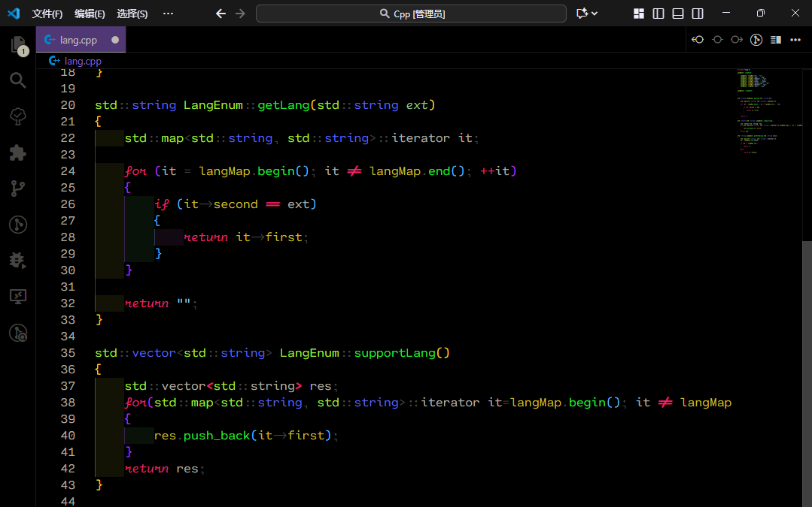

# XpyJs Black

XpyJs Black is a pure black theme that reduces visual fatigue and highlights the workspace. In terms of code color, different color schemes are used as much as possible to distinguish different contents, enabling developers to quickly scan the required content. And the parameters have been optimized, highlighting the usage paths of the parameters for easy reference.

## Screenshots

TypeScript

Vue

React

Python

Cpp

CSharp

## Highlights

- Tuned token scopes for JS/TS, JSON, HTML, CSS, Python, Go, and Markdown so shared concepts use the same tone across files.
- Semantic highlighting enabled to keep lambda and inline parameters consistent at declaration and usage sites.
- Desaturated UI chrome against a pure black editor background for maximum contrast without glare.
- Carefully spaced accent colors for keywords, booleans, and errors to make diagnostics pop without overwhelming the code surface.

## Quick Preview

| Scope | Color | Notes |
| --- | --- | --- |
| Function parameters | `#93c598` italic | Applies in declarations and inline usages via semantic tokens |
| Object property keys | `#dedcd5` | Lighter neutral differentiates from variable yellow |
| Flow keywords (`if`, `return`, etc.) | `#eb266d` | Warm accent keeps control flow visible |
| Strings | `#9bd2eb` | Cool blue for readability on black |

## Installation

1. **Marketplace (recommended):** once published, search for `XpyJs Black` in the VS Code Extensions view and install.
2. **Manual install:**
   - Clone or download this repository.
   - Run `npm install` if you plan to package with `vsce`.
   - Execute `npm run package` to create a `.vsix` file, then install it with `code --install-extension <file>.vsix`.

After installation, choose **Preferences > Color Theme > XpyJs Black**.

## Customization Tips

- Scope tweaks live in `themes/xpyjs-theme-black.json`. Search for the relevant TextMate scope (for example `meta.object-literal.key`) and adjust the `foreground` color.
- To change semantic token behavior (e.g., parameter styling), edit the `semanticTokenColors` block near the top of the same file.
- UI chrome colors are under the `colors` section if you want to adapt the side bar or activity bar.

## Release Notes

### 0.0.1

- Initial public release of XpyJs Black with tuned parameter and object key styling.
